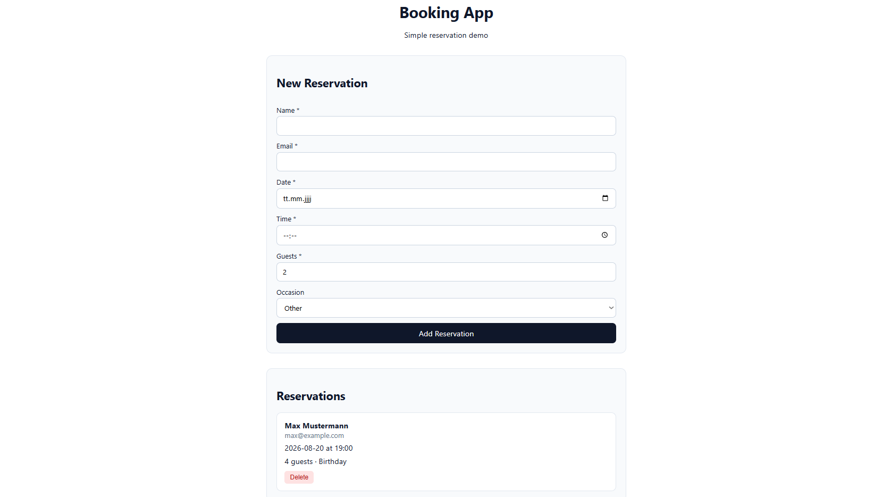
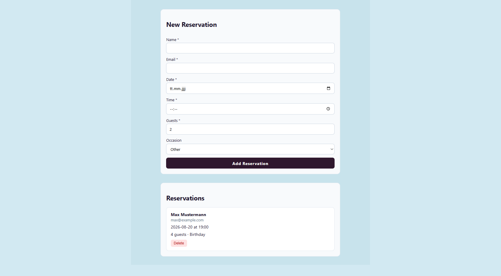

# Booking App


A lightweight full‑stack reservation demo built to demonstrate **MongoDB** integration, **Docker** containerization, and a clean **Express + React (TypeScript)** setup.
Users can create, list, and delete table reservations. The API persists data in MongoDB; the frontend is a simple React app. API and database run together via Docker Compose.

---

## Screenshots

### Booking Form



### Reservation added



---

## Live / Local

| Service  | URL                                       |
| -------- | ----------------------------------------- |
| Frontend | http://localhost:5173                     |
| API      | http://localhost:3000                     |
| Health   | http://localhost:3000/api/health          |
| MongoDB  | `localhost:27017` (database: `bookingdb`) |

> There is no public production deployment for this demo. Run everything locally.

---

## Features

- Create a reservation (name, email, date, time, guests, occasion)
- List all reservations
- Delete a reservation
- Data stored in **MongoDB**
- **Docker Compose** setup for API + MongoDB
- TypeScript on both client and server
- Simple, responsive UI

---

## Tech Stack

| Layer    | Technology                        |
| -------- | --------------------------------- |
| Frontend | React 19, TypeScript, Vite        |
| Backend  | Node.js, Express, TypeScript, tsx |
| Database | MongoDB 7 + Mongoose              |
| DevOps   | Docker, Docker Compose            |
| Tooling  | ES modules, dotenv, cors          |

---

## Project Structure

```text
booking-app/
├── client/                 # React + Vite frontend
│   ├── src/
│   │   ├── api/            # Fetch helpers for the REST API
│   │   ├── components/     # ReservationForm, ReservationList
│   │   ├── data/            # Mock data (dev only, optional)
│   │   ├── types/           # Shared TS types
│   │   ├── App.tsx
│   │   └── main.tsx
│   └── package.json
│
├── server/                 # Express API
│   ├── src/
│   │   ├── config/         # MongoDB connection
│   │   ├── models/         # Mongoose schemas
│   │   ├── controllers/    # Route handlers
│   │   ├── routes/         # Express routers
│   │   ├── app.ts          # Express app setup
│   │   └── server.ts       # Entry point
│   ├── Dockerfile
│   ├── .dockerignore
│   └── package.json
│
├── docker-compose.yml      # API + MongoDB
└── README.md
```

---

## API Endpoints

| Method | Endpoint                | Description                           |
| ------ | ----------------------- | ------------------------------------- |
| GET    | `/api/health`           | Health check                          |
| GET    | `/api/reservations`     | List all reservations                 |
| POST   | `/api/reservations`     | Create a reservation                  |
| DELETE | `/api/reservations/:id` | Delete a reservation by MongoDB `_id` |

### Example: create a reservation

```bash
curl -X POST http://localhost:3000/api/reservations \
  -H "Content-Type: application/json" \
  -d '{
    "name": "Max Mustermann",
    "email": "max@example.com",
    "date": "2026-08-20",
    "time": "19:00",
    "guests": 4,
    "occasion": "Birthday"
  }'
```

### Example body fields

| Field      | Type   | Required | Notes                                                     |
| ---------- | ------ | -------- | --------------------------------------------------------- |
| `name`     | string | yes      |                                                           |
| `email`    | string | yes      |                                                           |
| `date`     | string | yes      | `YYYY-MM-DD`                                              |
| `time`     | string | yes      | `HH:mm`                                                   |
| `guests`   | number | yes      | 1–10                                                      |
| `occasion` | string | no       | `Birthday` \| `Anniversary` \| `Other` (default: `Other`) |

---

## Getting Started

### Prerequisites

- Node.js 20+
- npm
- Docker Desktop (or Docker Engine + Compose plugin)
- Optional: local MongoDB, if you run the API without Docker

### Option A – Docker (recommended for API + DB)

From the repository root:

```bash
docker compose up --build
```

This starts:

- MongoDB on port `27017`
- API on port `3000`

In a second terminal, start the frontend:

```bash
cd client
npm install
npm run dev
```

Open http://localhost:5173

Stop the stack:

```bash
docker compose down
```

Remove containers and the MongoDB volume (deletes stored data):

```bash
docker compose down -v
```

### Option B – Local API (without Docker)

1. Start MongoDB locally (or use a MongoDB Atlas URI).
2. Configure the server env:

```bash
   cd server
   cp .env.example .env
```

Example `.env`:

```env
   PORT=3000
   MONGODB_URI=mongodb://localhost:27017/bookingdb
```

3. Install and run the API:

```bash
   npm install
   npm run dev
```

4. In another terminal, run the client:

```bash
   cd client
   npm install
   npm run dev
```

---

## Environment Variables

### Server (`server/.env`)

| Variable      | Description               | Default                               |
| ------------- | ------------------------- | ------------------------------------- |
| `PORT`        | API port                  | `3000`                                |
| `MONGODB_URI` | MongoDB connection string | `mongodb://localhost:27017/bookingdb` |

Inside Docker Compose, `MONGODB_URI` is set to:

```text
mongodb://mongo:27017/bookingdb
```

(`mongo` is the Docker Compose service name.)

### Client (optional – `client/.env`)

| Variable       | Description               | Default                     |
| -------------- | ------------------------- | --------------------------- |
| `VITE_API_URL` | Base URL for API requests | `http://localhost:3000/api` |

---

## Development Scripts

### Server

```bash
cd server
npm run dev      # tsx watch – API with auto-reload
npm run build    # compile TypeScript → dist/
npm start        # run compiled JS (after build)
```

### Client

```bash
cd client
npm run dev      # Vite dev server
npm run build    # production build
npm run preview  # preview production build
```

---

## How it works

- The React frontend loads reservations via `GET /api/reservations`.
- Creating a reservation sends `POST /api/reservations`; the API stores the document in MongoDB and returns it (including `_id`).
- The client maps MongoDB `_id` → frontend `id`.
- Deleting calls `DELETE /api/reservations/:id` and updates the UI after a successful response.
- With Docker Compose, the API container connects to the `mongo` service on the internal Docker network; data is persisted in a named volume.

---

## Design decisions

- TypeScript on client and server for safer refactors and clearer contracts
- Mongoose for schema validation and a simple model layer
- Docker Compose so MongoDB + API start with one command (portfolio-friendly DevOps signal)
- Multi-stage Dockerfile for the API: a build stage compiles TypeScript to `dist/`, then a clean production stage installs only prod dependencies (`npm ci --omit=dev`) and copies in the compiled output — no TypeScript/tsx toolchain or source files in the final image
- API container runs as the non-root `node` user (least-privilege principle)
- Frontend kept outside Docker during development for fast HMR with Vite
- Small, focused feature set – clear demo of CRUD + persistence + containers

---

## Possible next steps

- [ ] Add update (PUT/PATCH) for reservations
- [ ] Input validation middleware (e.g. Zod)
- [ ] Simple auth or rate limiting
- [ ] Containerize the frontend (nginx or Node) in Compose
- [ ] Basic tests (Supertest + Vitest/Jest)
